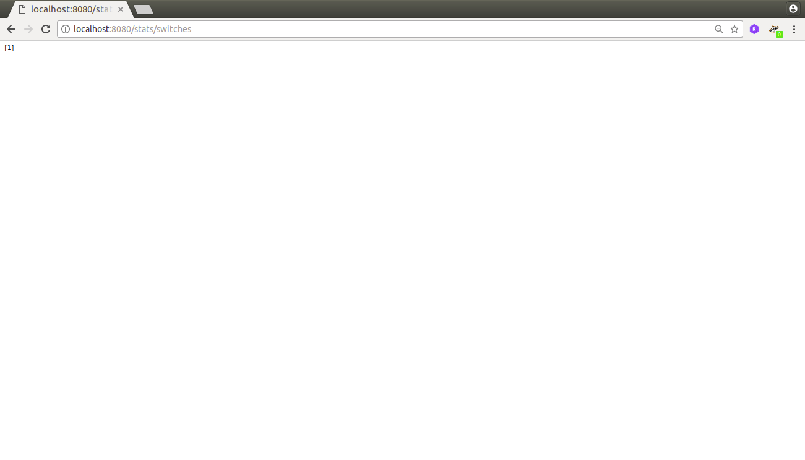
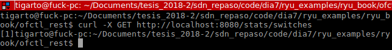
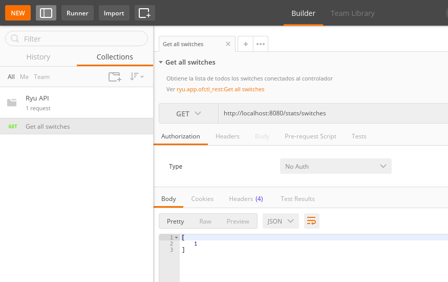

# OFCTL REST#


## ¿Por que usar el API REST? ##
Esta API es de utilidad por que:
1. Facilita ver el estado actual de los switches concetados al controlador. 
2. Facilita la inlación manual de nuevos flujos y grupos.
3. Facilita la obtención y actualización de estadisticas.

## Recomendaciones ##

* Usar en ambiente de depuración no de produccion producción, esto por cuestiones de seguridad principalmente.
* Emplear un consumidor de la interfaz, para el caso se pueden emplear herramientas como curl y postman.

## Resumen ##

Anteriormente se mostro la capacidad para construir aplicaciones internas codificadas teniendo en cuenta el lenguaje y la interfaz de programación del controlador. El ejemplo analizado fue el **simple_switch**; en este, el controlador definia la lógica necesaria para hacer que el switch openflow se comportara como un swit tradicional. Sin embargo, en este caso, es posible que se le indique a un switch openflow la manera de funcionar (como **simple_switch** para el caso) por medio de la REST API. En el siguiente [enlace](https://ryu.readthedocs.io/en/latest/app/ofctl_rest.html#id10) se muestra como construir aplicaciones para Ryu usando el REST API. 

## Ejemplos ##

A continuación se van a experimentar los ejemplos analizando las paginas:
1. [Interactive Ryu with Postman](https://inside-openflow.com/2016/06/23/interactive-ryu-with-postman/)
2. [Built-in Ryu applications with ryu.app.ofctl_rest
](https://ryu.readthedocs.io/en/latest/app/ofctl_rest.html#id10)

Para el caso se emplearán las siguientes herramientas para consumo de la interfaz:
1. curl
2. postman

### Ejemplo 1 ###
Este ejemplo va a seguir con calma los pasos descritos en el enlace [Interactive Ryu with Postman](https://inside-openflow.com/2016/06/23/interactive-ryu-with-postman/). Para el caso, se asume que ya se instalo **postman**. 

1. Arrancar la topologia:

```
sudo mn --topo single,3 --mac --switch ovsk --controller remote
```

2. Arrancar el controlador:

```
sudo ryu-manager simple_switch.py ofctl_rest.py
```

3. Mirando los swiches conectado en  el browser (**URL**: http://localhost:8080/stats/switches)



El mismo proceso se llevo a cabo mediante el uso del comando **curl** asi: curl -X GET http://localhost:8080/stats/switches. La siguiente figura muestra el resultado:



El mismo procedimiento se hace con el **postman**. A continuación se muestra el resultado:




4. Los demas procedimientos no se describieron a profundidad, para un mejor analisis lo invitamos a ver el enlace [Interactive Ryu with Postman](https://inside-openflow.com/2016/06/23/interactive-ryu-with-postman/) que fue de donde se saco esto.

## Conclusiones ##
Mirar como automatizar un poco este procedimiento por medio de python scripting y luego buscar conexión con otro tipo de aplicaciones.


## Enlaces sin organizar ##

* https://mik.bme.hu/~zfaigl/QoS/doc/README.html
* https://pdfs.semanticscholar.org/e7a6/8f5b35b986902ce8cf8244c15d0950cf26e2.pdf
* http://dehesa.unex.es/bitstream/handle/10662/4417/TFMUEX_2016_Amarilla_Cardoso.pdf?sequence=1&isAllowed=y
* https://inside-openflow.com/2016/12/14/ip-reputation-mitigation-api/
* https://hal.inria.fr/hal-01539656/document
* https://www.mdpi.com/2224-2708/7/3/33/htm
* https://ecs.victoria.ac.nz/foswiki/pub/Groups/SDN/Publications/Final_Report_-_Jordan_Ansell.pdf
* https://inside-openflow.com/2016/12/14/ip-reputation-mitigation-api/
* https://sdndos.wordpress.com/
* https://www.kth.se/social/files/569421cff276546db5254b80/Final_report_CRAVED.pdf
* https://www.researchgate.net/publication/323717318_Multi-controller_Based_Software-Defined_Networking_A_Survey
* orchflow
* https://www.grotto-networking.com/SDNfun.html#basic-graph-creation-and-an-algorithm
* https://www.kth.se/social/files/569421cff276546db5254b80/Final_report_CRAVED.pdf (sobre metricas)
* https://ryu.readthedocs.io/en/latest/app/ofctl_rest.html
* https://inside-openflow.com/2016/06/23/interactive-ryu-with-postman/
